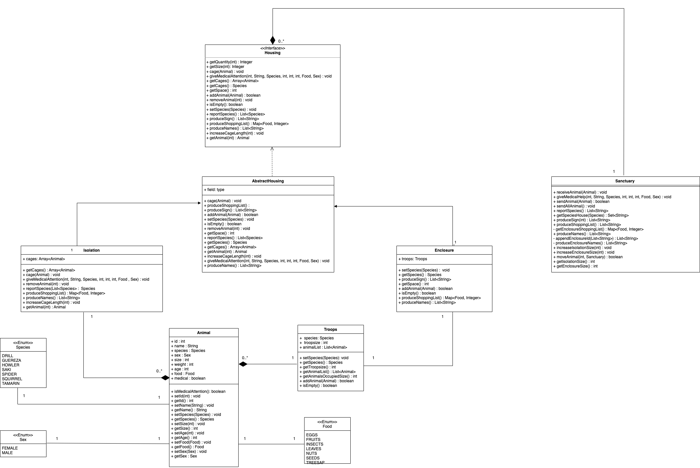
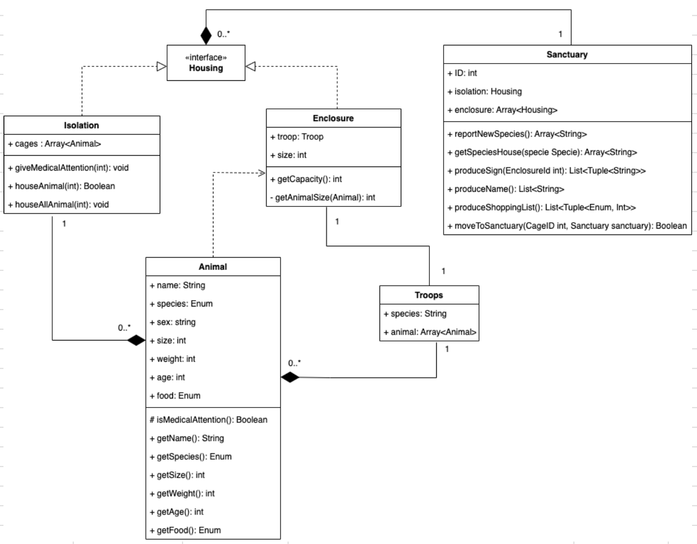

# Project Description
The Jungle Friends Primate Sanctuary Links to an external site.provides a permanent home and high-quality sanctuary care for New World primates who have been cast-off from the pet trade, retired from research, or confiscated by authorities. They are seeking to replace all of their paper records with computer records where they can keep track of the individual animals that are in their care.

# UML
Updated UML


Old UML


##Changes made in the Updated UML
I have added more methods in the class Isolation and Enclosure to support essential functionalities. Apart from that the design structure remains the same.

## Assumptions 
* The assumption we have made in this project is that the troop size is predefined. 

## Limitations 
* The limitation of this project is that we need to know the animal's cage id to access some information. 
* If the program stops running for some reason, all the data would be lost. 

#How to Run the Jar File
To run the jar file we write the following command in the terminal : java -jar out/artifacts/Project_1_jar/new.jar

# How to run a program
## Initialize Sanctuary
``Sanctuary s = new Sanctuary(32, 5, 2, 50);``

## Initialize Animals
``Animal a = new Animal();``

``Animal b = new Animal();``

``Animal c = new Animal();``

## Receive Animals in Isolation

``s.receiveAnimal(a);``

``s.receiveAnimal(b);``

``s.receiveAnimal(c);``

## Give Medical Help 

``s.giveMedicalHelp(0, "Abhishek", Species.HOWLER, 22, 40, 5, Food.FRUITS, Sex.MALE);``

``s.giveMedicalHelp(2, "Ketaki", Species.HOWLER, 22, 40, 5, Food.NUTS, Sex.FEMALE);``


## Send All Animals to Enclosure 
``s.sendAllAnimal();``

## Report Species with their Locations
``s.reportSpecies();``

## Get a particular Species' House 

``s.getSpeciesHouse(Species.HOWLER);``

## Produce a Sign for an Animal

``s.produceSign(1);``

## Produce a Shopping List of Favourite Foods according to the Animal's size
``s.produceShoppingList();``

## Produce Names of Animals Alphabetically 
``s.produceNames();``

## Increase the Isolation Size 
``s.increaseIsolationSize(5);``

## Increase the Enclosure Size 

``s.increaseEnclosureSize(3);``

## Move to Another Sanctuary 

```
Sanctuary s1 = new Sanctuary(2, 3, 4, 20);
s.moveAnimal(1, s1);
```

## Example Run
We have intialized the Sanctuary and all the methods of the class have been called here to test. 
```
    Sanctuary s = new Sanctuary(32, 5, 2, 50);
    Animal a = new Animal();
    Animal b = new Animal();
    Animal c = new Animal();
    s.receiveAnimal(a);
    s.receiveAnimal(b);
    s.receiveAnimal(c);

    s.giveMedicalHelp(0, "Animal1", Species.HOWLER, 22, 40, 5, Food.FRUITS, Sex.MALE);
    s.giveMedicalHelp(2, "Animal2", Species.HOWLER, 22, 40, 5, Food.NUTS, Sex.FEMALE);

    s.sendAllAnimal();
    s.giveMedicalHelp(1, "Animal3", Species.GUEREZA, 22, 40, 5, Food.FRUITS, Sex.MALE);
    s.reportSpecies();
    s.getSpeciesHouse(Species.HOWLER);

    s.produceSign(1);

    s.produceShoppingList();

    s.produceNames();
    s.increaseIsolationSize(5);
    s.increaseEnclosureSize(3);

    Sanctuary s1 = new Sanctuary(2, 3, 4, 20);
    s.moveAnimal(1, s1);
```

## Citations
1. [Canvas Question](https://northeastern.instructure.com/courses/136753/assignments/1707737?module_item_id=8409809)
2. [Java Documentaion](https://docs.oracle.com/en/java/)
3. [Stack Overflow](https://stackoverflow.com/)